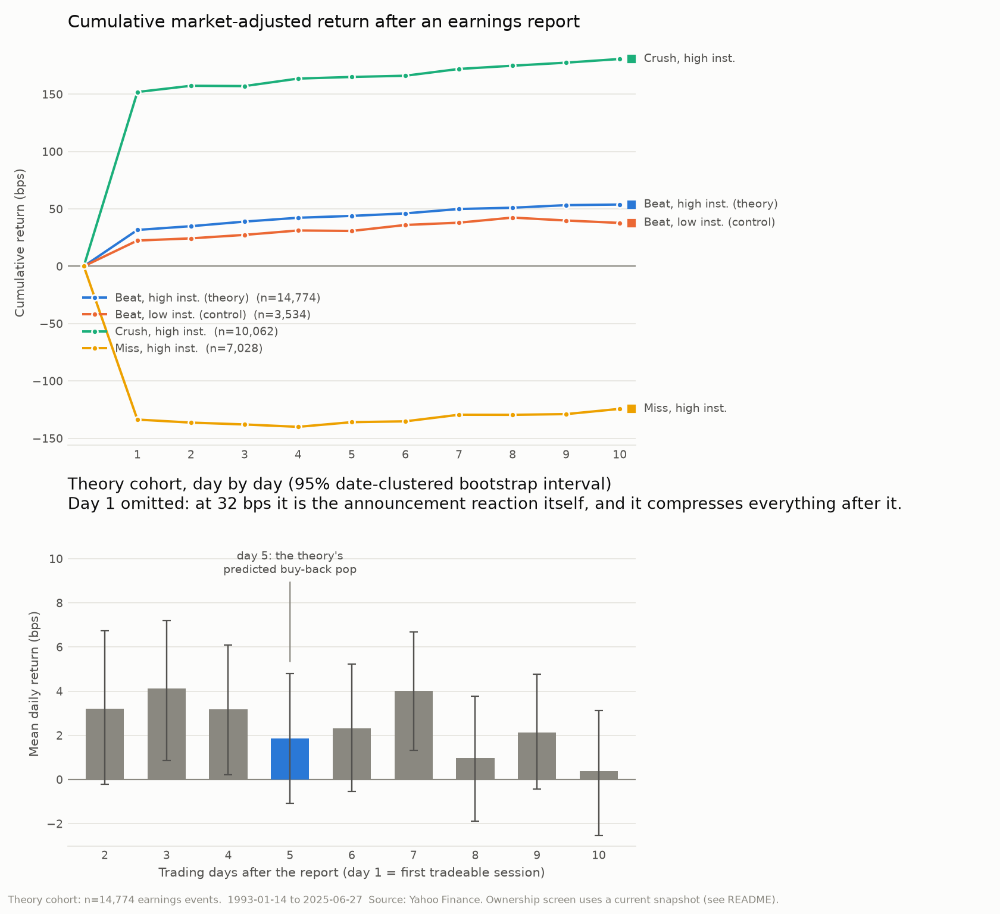
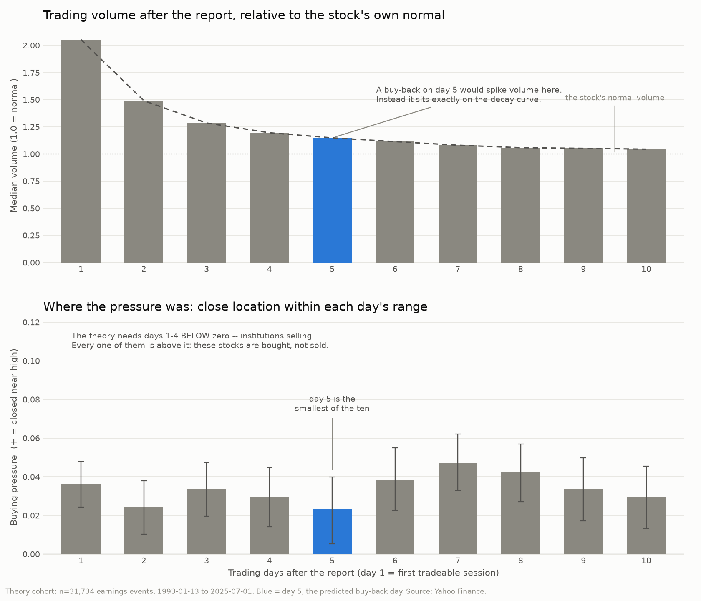

# Institutional Sell-Off / Day-5 Buy-Back Backtest

An event study that tests a specific, falsifiable claim about how heavily
institutionally-owned stocks trade after an earnings beat.

## The theory under test

> For companies that are **at least 80% institutionally held**, after an earnings
> report where they **beat** their earnings target — beat, not *crush* — the
> stock price drops slightly as the institutions sell off shares, and then rises
> on **the 5th day** when the institutions buy back in.

That is two separate predictions, and this project tests them separately:

| | Claim | How it's measured |
|---|---|---|
| **H1** | *the dip* — the stock drifts down after the beat | mean cumulative market-adjusted return over days 1–4 is **negative** |
| **H2** | *the pop* — it rises on the 5th day | mean market-adjusted return **on day 5** is **positive** |

Both are tested one-sided, in the direction the theory predicts, so the theory
gets the benefit of the doubt.

## Why the control groups matter more than the headline number

The theory does not merely predict a pattern, it predicts a **mechanism**:
institutions selling and then repurchasing. So the run reports the theory's
cohort next to the cohorts that would falsify the mechanism:

- **Beat + *low* institutional ownership.** If lightly-held stocks show the same
  day-5 pop, the pattern has nothing to do with institutions.
- **Crush + high institutional ownership** and **Miss + high institutional
  ownership.** These calibrate the engine against a documented effect
  (post-earnings-announcement drift), and show whether "beat" is really special.

A finding that survives only in the first row is interesting. A finding that
appears in every row is a market-wide artefact.

## Running it

```bash
pip install -r requirements.txt
python3 -m isb --chart                     # full S&P 500 universe, ~5-10 min first run
python3 -m isb --limit 25 --chart          # quick sanity run
```

Results land in `results/`: `events.csv` (every event with its forward returns),
`daily_profile.csv`, `cohorts.csv`, `beat_band_sweep.csv`, `result.json`, and
`car_profile.png`. Raw API responses are cached under `cache/`, so re-runs with
different parameters are fast and hit the network only for what changed.

### Useful flags

| Flag | Why you'd use it |
|---|---|
| `--min-inst-pct 80` | the ownership threshold (percent) |
| `--beat-max-pct 10` | where a "beat" becomes a "crush" (percent EPS surprise) |
| `--pop-day 5` / `--dip-through 4` | move the predicted pop / dip window |
| `--start 2010-01-01` | restrict the sample period |
| `--require-known-timing` | keep only events with a real release timestamp |
| `--timing-policy next_day` | robustness check on the day-1 definition |
| `--raw-returns` | unadjusted instead of market-adjusted returns |
| `--ownership-csv FILE` | supply point-in-time ownership (see bias #1 below) |

## How the definitions are pinned down

**"Beat but didn't crush."** A beat is `0 < surprise ≤ beat_max_pct`, where
surprise is `(actual EPS − consensus estimate) / |estimate|`. The boundary is
arbitrary, so every run sweeps it across 2.5%–30% (`beat_band_sweep.csv`). A
result that only appears at one cutoff is an artefact, not a finding. Events
where the estimate is smaller than $0.05 are dropped: a $0.00-vs-$0.01 miss is
not a −100% surprise in any economic sense.

**"The 5th day."** Earnings land before the open, after the close, or
mid-session, so the calendar date is not the same thing as the first tradeable
session. Each event is anchored to the **last close before the market could
react**; day 1 is the first session that could trade the news; day 5 is the fifth
such session. Release timestamps are read from the data where Yahoo has them
(`bmo` / `amc` / `intraday`); where it stores only a midnight placeholder — most
of the pre-2010 history — the event is marked `unknown` and defaults to
next-day, because assuming same-day on a release that was actually after the
close would anchor on a price that already contained the news. `--require-known-timing`
re-runs on only the unambiguous events.

**Returns.** Split- and dividend-adjusted closes. The headline numbers are
market-adjusted (stock return minus SPY return) so the cohort's results are not
just the market's.

## The statistics

Two corrections do most of the work here, and both make it *harder* to call the
theory true:

- **Date clustering.** Earnings pile into a few weeks a quarter, so events are
  not independent draws — names reporting the same day share a market shock.
  Significance is computed on the distribution of daily cluster means, and the
  bootstrap resamples whole dates.
- **Multiple testing.** "Day 5" was chosen after the fact. Testing ten horizons
  and reporting the best one manufactures significance, so `daily_profile.csv`
  reports all ten days with Holm and Benjamini-Hochberg adjusted p-values
  alongside the raw ones.

## Known biases — read before believing any of this

1. **Institutional ownership is a *current* snapshot, not point-in-time.** This
   is the big one. Yahoo reports what a company's institutional ownership is
   *today*; the events run back decades. A company that is 85% institutionally
   held now was not necessarily so in 2003. That imports look-ahead and
   selection bias into the screen itself. Use `--ownership-csv` if you have
   real point-in-time 13F-derived ownership; a proper fix means reconstructing
   holdings from SEC 13F filings, which this project does not do.
2. **Survivorship.** The universe is the S&P 500 plus names historically removed
   from it. Including removed names helps, but the ownership screen still
   silently requires a company to exist today with a Yahoo ownership record, so
   the surviving-company tilt is not fully removed.
3. **Consensus estimates are as-reported-now.** Yahoo's stored estimate is not a
   guaranteed point-in-time snapshot of the pre-release consensus.
4. **No costs.** Returns are gross. A strategy trading every event pays spread
   and commission on each leg, which is material for effects measured in a few
   basis points.
5. **Earnings coverage ends around mid-2025** in Yahoo's dataset, even though
   prices are current.

## Layout

```
isb/
  yahoo.py      Yahoo Finance client (prices, earnings, ownership) + disk cache
  universe.py   S&P 500 universe and the institutional-ownership screen
  events.py     earnings -> aligned event panel; beat/crush/miss; day-1 anchoring
  stats.py      clustered t-tests, block bootstrap, Holm/BH corrections
  backtest.py   the study: H1/H2 tests, cohort comparisons, parameter sweep
  plotting.py   the CAR chart
  cli.py        command line
```

`yfinance` is deliberately not used: its HTTP layer fails behind egress proxies,
and only three endpoints are needed.

---

# Results — round 1: the theory as stated

Run of record: **503 S&P 500 tickers, 45,797 earnings events, 1993–2025**, of
which **14,766 events** across 494 tickers form the theory's cohort (≥80%
institutionally held, EPS surprise between 0% and +10%). Market-adjusted
returns, date-clustered inference.



## Verdict: the theory is not supported. Both halves fail.

| | Prediction | Result | |
|---|---|---|---|
| **H1** | dip over days 1–4 | **+42.3 bps**, p < 0.001 | wrong direction, and significantly so |
| **H2** | day 5 is positive | +1.9 bps, p = 0.22 | not distinguishable from zero |
| **H2b** | day 5 beats its neighbours | −1.5 bps, p = 0.39 | day 5 is, if anything, *below* average |

**H1 is backwards.** After a modest beat, these stocks do not drift down — they
go *up*, by about 42 bps over days 1–4, and that is one of the most statistically
solid numbers in the whole study. There is no institutional sell-off to be seen.

**H2 is a coin flip.** Day 5 averages +1.9 bps — roughly two hundredths of one
percent — with a 95% interval of [−1.1, +4.8] bps that comfortably contains zero.
The win rate is 50.1%.

**H2b is the one that really settles it.** Day 5's mean is *lower* than the
average of days 2, 3, 4, 6 and 7. Whatever small positive number day 5 shows is
the ordinary drift every day in the window has; nothing happens on day 5 in
particular. And in the day-by-day table, once you correct for having looked at
all ten days, the only day that survives besides the announcement itself is
day 7 — which nobody predicted, and which is exactly what testing ten horizons
will hand you by chance.

**The mechanism fails its own test.** Beats in *lightly*-held stocks behave
almost identically: the day-5 gap between high- and low-institutional names is
2.7 bps with p = 0.33. In the chart's top panel the theory cohort (blue) and its
low-institutional control (orange) trace nearly the same path. If institutions
were driving this, those two lines would have to diverge. They don't.

**It isn't an artefact of where we drew the beat/crush line.** Sweeping the
boundary from 2.5% to 30% never produces a significant day 5 (best case p = 0.11),
and never produces the predicted dip except in the narrowest 2.5% band.

## Robustness

Every variant tells the same story:

| Variant | n | H1 (days 1–4) | H2 (day 5) | H2b (vs neighbours) |
|---|---|---|---|---|
| Headline | 14,766 | +42.3, p<0.001 | +1.9, p=0.22 | −1.5, p=0.39 |
| Only events with a real release timestamp (2011–2025) | 7,226 | +36.2, p<0.001 | +1.5, p=0.49 | −0.7, p=0.76 |
| Force all events to next-day reaction | 14,766 | +31.2, p<0.001 | +1.8, p=0.24 | −1.5, p=0.37 |
| Raw (unadjusted) returns | 14,774 | +58.5, p<0.001 | +8.4, **p=0.002** | +0.6, p=0.85 |

That last row is worth dwelling on, because it is how this theory could look true
to someone testing it casually. On raw returns, day 5 *is* significantly positive.
But so is nearly every other day — it's just the market's general upward drift,
and it disappears the moment you subtract the benchmark or compare day 5 against
its own neighbours.

## Is the engine actually detecting anything?

Yes — it independently reproduces post-earnings-announcement drift, one of the
most-replicated effects in the literature, which is a good sign the null results
above are real rather than a broken pipeline:

| Cohort | Cumulative market-adjusted return, days 1–4 | |
|---|---|---|
| Crush (surprise > 10%) | **+163.6 bps**, p < 0.001 | prices keep rising after a big beat |
| Miss | **−140.0 bps**, p < 0.001 | and keep falling after a miss |
| Small beat (the theory's cohort) | +42.3 bps, p < 0.001 | in between, as you'd expect |

The signal the theory is looking for isn't there; a well-documented signal in the
same data is, loudly.

## What the friend may have been seeing

The drift *is* real, so a small beat is genuinely followed by a small upward
grind. On any given event you'll find plenty of examples where the stock dipped
for a few days and then jumped on the fifth — with ~15,000 events, thousands of
them do exactly that. What the data rejects is that it happens *more often than
chance*, or more often for institutionally-held names.

One caveat in the theory's favour: the ownership screen uses a current snapshot
rather than point-in-time holdings (bias #1 above). If ownership is measured
wrong, the high/low split is noisier than it should be, which would blunt a real
institutional effect. Re-running with `--ownership-csv` and real 13F-derived
history is the honest way to close that gap — but note that H1 and H2b fail on
their own terms regardless of how the cohort is split.

---

# Results — round 2: looking where the theory should work best

A null result on large caps is a weak test of this particular theory, for a
reason worth stating plainly: **the S&P 500 is the worst possible place to look
for it.** If institutions dumping stock moves a price, that happens in a company
where one fund owns 8% of a thin float — not in Apple, where 7,749 institutions
hold shares and the top ten together hold barely a third. Round 1 tested the
mechanism where it is least able to operate.

So round 2 widens the search and, more importantly, tests the mechanism
*directly*. Universe extended to **2,151 tickers** across the S&P 500, 400 and
600 — including **788 names historically removed from those indices**, which
partly repairs the survivorship problem. **123,007 earnings events; 31,708 in the
theory's cohort.**

```bash
python3 -m isb --index sp500,sp400,sp600 --probe --chart
```

Every test below was declared before it was run and is corrected across the
whole battery. That discipline matters: after a null result it is very easy to
keep slicing until something clears p<0.05, and with 24 slices something usually
does.

## The headline is unchanged at 2× the sample

| | Prediction | Result |
|---|---|---|
| **H1** | dip over days 1–4 | **+43.5 bps**, p < 0.001 — wrong direction |
| **H2** | day 5 positive | +1.7 bps, p = 0.26 |
| **H2b** | day 5 beats its neighbours | −1.1 bps, p = 0.50 |

## There is no gradient in anything

If institutional selling drives the effect, it must get *stronger* where
institutions dominate. It doesn't move at all:

| Split | Day-5 return across buckets (bps) | Gradient? |
|---|---|---|
| Institutional ownership (<50% → ≥90%) | +2.3, −18.7, −3.6, −1.0, +3.5, +2.0 | none |
| Top-10 holder concentration (Q1→Q5) | +0.5, +1.3, +0.4, +2.0, +0.8 | none |
| Number of holders (few → many) | +1.7, +0.4, −1.0, +2.1, +2.0 | none |
| Market cap (small → large) | +0.6, +1.1, −1.0, +2.7, +1.4 | none |
| Index (small / mid / large) | +2.1 / +1.4 / +1.9 | none |

**Not one of the 24 tests survives correction** (lowest adjusted p = 0.89). The
small-cap slice, where the mechanism is most plausible, looks exactly like the
mega-cap slice.

## The decisive test: there is no institutional footprint at all



This is the test that settles it, and it doesn't depend on prices. The theory is
a claim about *order flow* — institutions sell for four days, then buy back on
the fifth. That has to leave a footprint in volume and in where each day closes
within its range, whether or not the net price moves.

**Volume decays smoothly and never bumps.** 2.05× normal on day 1, then 1.49,
1.29, 1.20, **1.15 on day 5**, 1.11, 1.08 … Day 5 sits exactly on the decay
curve. A coordinated repurchase by the largest holders of a stock cannot happen
without volume, and there is no volume.

**The pressure runs the wrong way every single day.** Close-location value is
*positive* on all ten days (p < 0.001) — these stocks are being bought up into
the close, not sold off. The theory needs days 1–4 negative. And day 5, the
supposed buy-back day, has the *smallest* buying pressure of the ten.

So the mechanism isn't merely failing to show up in prices. It isn't in the order
flow either, which is where it would have to be first.

## What the study could have detected

| Quantity | Observed | Detectable at 80% power |
|---|---|---|
| Day-5 return | +1.7 bps | **4.3 bps** |
| Days 1–4 cumulative | +43.5 bps | 11.9 bps |

So this is not "we couldn't tell". Any day-5 effect larger than about **4 basis
points — four hundredths of one percent** — would have shown up. For scale, you'd
need something on the order of 20–50 bps before it survived spreads and
commissions. An effect small enough to hide from this sample is far too small to
trade.

## The one thing that flickered — and why it isn't evidence

Per-stock heterogeneity was the only test in the battery to come near
significance: across 789 tickers with ≥20 events each, the spread of per-stock
t-statistics was 1.043 against 1.000 expected under the null (p = 0.043), and
3.3% of stocks looked significantly positive against 2.5% expected (p = 0.098).

Reported for completeness, but it should not be read as support. An excess of
0.8 percentage points is what mild residual within-ticker correlation produces on
its own; it is one marginal result out of 24 pre-registered tests, which is fewer
than chance alone would predict; and it does not survive correction. Chasing the
specific tickers behind it would be exactly the mistake this battery was built to
prevent — with 789 names, some will always look good.

## Where the theory could still, honestly, be hiding

Two gaps remain, and neither is closed by this data:

1. **Point-in-time ownership.** The screen still uses a current snapshot, so the
   high/low split is noisier than it should be. Real 13F-derived history would
   sharpen it (`--ownership-csv`). But note the ownership *gradient* is flat
   across six buckets — for measurement error to be hiding a real effect, it
   would have to be flattening every one of them.
2. **Intraday timing.** All of this is close-to-close. If institutions sell into
   the day-1 open and repurchase at the day-5 close, minute-bar data would show
   it and daily bars would not. That requires a paid intraday feed; Yahoo only
   serves recent intraday history.

Beyond those, the result is about as clean as this kind of question gets: no
price effect, no gradient in any variable the mechanism depends on, and no
footprint in the order flow the mechanism is made of.

---

# Appendix: the beat/crush threshold cannot rescue it

"Beat" is a precise term — reported EPS above consensus — and the surprise
percentage has a standard formula, `(actual − estimate) / |estimate|`, which is
what this study uses. "Crush" is colloquial and has **no standard numeric
threshold**; in an earnings context the word most often refers to something else
entirely (*IV crush*, the collapse in implied volatility after an announcement,
which is about options pricing rather than share-price direction).

Rather than argue about where the line sits, `--probe` sweeps a grid over both
edges at once — where a beat starts, and where it becomes a crush — so whatever
pair of values anyone has in mind, the answer is already in the table
(`results/beat_grid.csv`, 34 cells, cohort sizes 8,103–58,679 events).

**Day-5 return (bps), by beat floor (rows) and crush ceiling (columns):**

| floor \ ceiling | 5% | 10% | 15% | 20% | 25% | 30% | 50% |
|---|---|---|---|---|---|---|---|
| **0%** | 1.33 | 1.73 | 1.27 | 0.91 | 0.95 | 0.74 | 0.60 |
| **1%** | 1.67 | 1.93 | 1.41 | 1.02 | 1.05 | 0.84 | 0.69 |
| **2%** | 2.53 | 2.36 | 1.68 | 1.22 | 1.24 | 1.00 | 0.82 |
| **3%** | 1.67 | 2.02 | 1.34 | 0.88 | 0.94 | 0.69 | 0.53 |
| **5%** | — | 2.21 | 1.23 | 0.67 | 0.76 | 0.46 | 0.31 |

- **0 of 34 cells** show a significant day-5 pop. The best raw p-value anywhere
  in the grid is 0.147 — and that is before correcting for having looked at 34
  of them.
- **0 of 34 cells** show the predicted dip. Every combination drifts *up* over
  days 1–4, and the wider the band, the more it drifts up (+2 bps at the
  narrowest, +153 bps at the widest).

The definition of a beat was never what this rested on.

---

# Appendix: the conditional form — "beat but still dropped"

A later clarification sharpened the claim: it is not that beats dip and then pop,
it is that **beats which actually fell** then recover on day 5. That is a
narrower and genuinely different population, so it gets its own test
(`results/conditional_drop_d*.csv`).

**Selecting on the outcome manufactures a bounce.** Any set of stocks chosen
*because* they just fell will tend to rise afterwards — bid-ask bounce plus the
ordinary correction of overreaction. So a positive day 5 here is guaranteed in
advance and proves nothing on its own. Only the controls can separate the theory
from the artefact.

Conditioning on having dropped through day 4 (n = 14,759 of the 31,734):

| Cohort | n | Mean drop | Day 5 | p |
|---|---|---|---|---|
| **Beat + high inst. (the theory)** | 14,759 | −415 bps | **+4.40 bps** | **0.018** |
| Beat + low inst. (control) | 2,966 | −375 bps | +2.87 bps | 0.39 |
| Crush + high inst. (control) | 13,346 | −481 bps | +3.41 bps | 0.22 |
| Miss + high inst. (control) | 21,612 | −556 bps | +0.75 bps | 0.73 |

This is the first significant day-5 result in the whole project. It does not
survive its two controls:

1. **It is not specific to institutions.** Crushes that dropped bounce +3.41;
   lightly-held beats that dropped bounce +2.87. The theory cohort's edge over
   crushes is **+0.98 bps (p = 0.70)** and over lightly-held beats **+1.52 bps
   (p = 0.67)**. Everything that falls, bounces, by about the same amount.
2. **It is not a day-5 event.** Day 5 is +4.40, day 6 is +2.48, day 7 is +3.24.
   Day 5 minus the average of days 6–7 is **+1.54 bps, p = 0.50**. It is a slow
   drift back up over most of a week, not a buy-back on the fifth day.

## Size-specific thresholds don't change it either

| Slice | n | Day 5 | vs days 6–7 |
|---|---|---|---|
| Small cap, 10% band | 2,710 | +4.64 (p=0.31) | +4.59 (p=0.39) |
| Mid cap, 10% band | 5,227 | +4.73 (p=0.12) | +1.05 (p=0.78) |
| Large cap, 10% band | 6,822 | +4.05 (p=0.07) | +0.70 (p=0.80) |
| Large cap, 5% band | 4,116 | +6.34 (p=0.01) | +2.74 (p=0.38) |

The small-cap-at-10% case — the specific one named — is not significant.

## And the bounce is not tradeable

The rule is implementable (the day-4 drop is observable before you buy), so it is
worth pricing honestly. Buy at the day-4 close, sell at the day-5 close:

| | |
|---|---|
| Gross edge | +4.40 bps per trade |
| Win rate | 50.3% |
| Volatility | 181 bps — **41× the edge** |

| Round-trip cost | Net | p |
|---|---|---|
| 2 bps | +2.40 | 0.20 |
| **5 bps** | **−0.60** | 0.75 |
| 10 bps | −5.60 | 0.003 |
| 20 bps | −15.60 | <0.001 |

A retail round-trip is roughly 5–10 bps of spread on a liquid large cap and
20–50 bps on a small cap. The edge is gone at 5 bps and reliably negative at 10.

**The fair summary:** the conditional form is the closest this theory has come to
being right, and the refinement did move the number. But what it found is
mean reversion — a thing that happens to every stock that falls, institutional or
not, spread across days 5 to 7 — and it is smaller than the cost of trading it.
